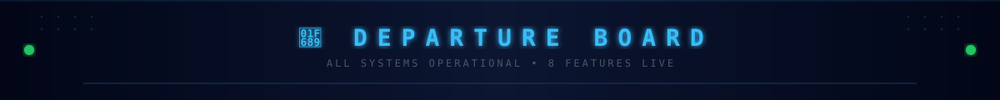
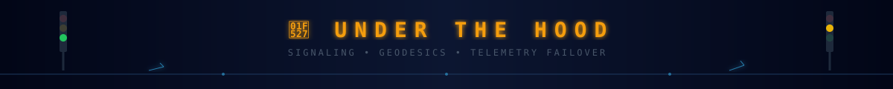
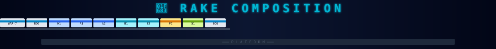
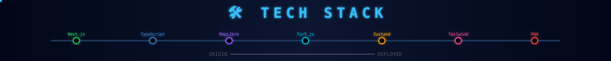
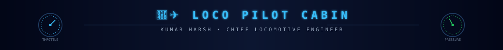

<div align="center">

<!-- ━━━━━━━━━━━━━ ANIMATED HERO BANNER ━━━━━━━━━━━━━ -->



<br/>

**Real-Time Locomotive Tracking • 60 FPS WebGL Vector Maps • Sub-300ms Telemetry Sync**

<br/>

[](https://github.com/kumarharsh21112003)
[](https://nextjs.org/)
[](https://www.typescriptlang.org/)
[](https://maplibre.org/)
[](LICENSE)

<br/>

```
🎫 BOARDING PASS                                           PNR: RP-2026-LIVE
━━━━━━━━━━━━━━━━━━━━━━━━━━━━━━━━━━━━━━━━━━━━━━━━━━━━━━━━━━━━━━━━━━━━━━━━━━
  FROM: Static HTML Pages     ══════►     TO: Real-Time Telemetry Engine
  CLASS: 1A (TypeScript Strict)           COACH: Next-14 / APP-ROUTER
  FARE: ₹ FREE FOREVER                   STATUS: ✅ CONFIRMED & LIVE
━━━━━━━━━━━━━━━━━━━━━━━━━━━━━━━━━━━━━━━━━━━━━━━━━━━━━━━━━━━━━━━━━━━━━━━━━━
```

</div>

<!-- ━━━━━━━━━━━━━ TRACK DIVIDER ━━━━━━━━━━━━━ -->


## ⚡ What is RailPulse?

**RailPulse** is an ultra-fast, real-time Indian Railways tracking & intelligence platform that replaces sluggish legacy portals with a blazing-fast, ad-free, 60 FPS experience.

It tracks live train positions, predicts delays using block-section signaling logic, renders GPU-accelerated route maps on WebGL, and provides granular coach composition data — all within **sub-300ms** response windows across **8,000+ Indian railway stations**.


<!-- ━━━━━━━━━━━━━ FEATURES BANNER ━━━━━━━━━━━━━ -->


## 🚉 Features — Departure Board

```
┌────────────────────────────────────────────────────────────────────────────────────────────┐
│  🚉 RAILPULSE CENTRAL — LIVE DEPARTURE BOARD                        🕐 SYNC: < 1 SEC     │
│────────────────────────────────────────────────────────────────────────────────────────────│
│                                                                                            │
│  TRAIN NO.    FEATURE                          DESTINATION             PF    STATUS        │
│  ─────────    ───────                          ───────────             ──    ──────        │
│  RP-001       Live Train Tracking              Real-Time Positioning    1    🟢 LIVE       │
│  RP-002       60 FPS WebGL Vector Map          GPU-Accelerated Maps     2    🟢 LIVE       │
│  RP-003       Smart Station Search             8,000+ Stations Index    3    🟢 LIVE       │
│  RP-004       Coach Position Visualizer        Platform Alignment       4    🟢 LIVE       │
│  RP-005       Station-to-Station Finder        Route Intelligence       5    🟢 LIVE       │
│  RP-006       Live Weather at Stations         Atmospheric Telemetry    6    🟢 LIVE       │
│  RP-007       Terrain Elevation Profile        Ghat Section Analysis    7    🟢 LIVE       │
│  RP-008       PWA Offline Mode                 Zero Downtime Access     8    🟢 LIVE       │
│                                                                                            │
└────────────────────────────────────────────────────────────────────────────────────────────┘
```


<!-- ━━━━━━━━━━━━━ ENGINE BANNER ━━━━━━━━━━━━━ -->


## 🔧 Under The Hood

### 🚦 Signaling & Delay Intelligence
RailPulse models India's real-world **4-Aspect Automatic Block Signaling**:

```
  🟢 GREEN ━━━━━━━━━━━━━ Proceed 130 km/h ━━━━━━━━━ Line clear 2+ blocks ahead
  🟡🟡 DBL YELLOW ━━━━━━ Caution 90 km/h ━━━━━━━━━━ Prepare for restricted speed
  🟡 YELLOW ━━━━━━━━━━━━ Restricted 30 km/h ━━━━━━━ Prepare to stop
  🔴 RED ━━━━━━━━━━━━━━━ STOP ━━━━━━━━━━━━━━━━━━━━━ Block section occupied
```

Instead of static timetables, RailPulse **recalculates downstream ETAs** using block occupancy, sectional speed limits, gradient resistance, and platform turnaround buffers.

### 🛰️ Geodesic Track Interpolation
GPS beacons in remote zones transmit erratically. RailPulse bridges gaps using **Cubic Hermite Spline Interpolation** along 68,000+ km of Broad Gauge geometry with **sub-10m distance resolution**.

### 🛡️ Multi-Source Failover
```
  NTES PRIMARY ━━► (< 200ms) ━━► RAILRADAR ━━► (fallback) ━━► DEAD-RECKONING CACHE
```


<!-- ━━━━━━━━━━━━━ RAKE BANNER ━━━━━━━━━━━━━ -->


## 🚃 Rake Composition

```
  DIRECTION OF TRAVEL ━━━━━━━━━━━━━━━━━━━━━━━━━━━━━━━━━━━━━━━━━━━━━━━━━━━━━━━━━━►

  ┌───────┐┌───────┐┌───────┐┌───────┐┌───────┐┌───────┐┌───────┐┌───────┐┌───────┐┌───────┐
  │ WAP-7 ││  EOG  ││  H1   ││  A1   ││  A2   ││  B1   ││  B2   ││  PC   ││  S1   ││  EOG  │
  │ LOCO  ││ POWER ││ 1ST AC││ 2T AC ││ 2T AC ││ 3T AC ││ 3T AC ││PANTRY ││SLEEPER││ POWER │
  │ 🟢    ││ ⚡    ││ ❄️    ││ ❄️    ││ ❄️    ││ ❄️    ││ ❄️    ││ 🍽️    ││ 💺    ││ ⚡    │
  └───┬───┘└───┬───┘└───┬───┘└───┬───┘└───┬───┘└───┬───┘└───┬───┘└───┬───┘└───┬───┘└───┬───┘
  ════╧════════╧════════╧════════╧════════╧════════╧════════╧════════╧════════╧════════╧═════
  ▓▓▓▓▓▓▓▓▓▓▓▓▓▓▓▓▓▓▓▓▓▓▓▓▓▓▓▓▓▓▓▓▓▓▓▓▓▓▓▓▓▓▓▓▓▓▓▓▓▓▓▓▓▓▓▓▓▓▓▓▓▓▓▓▓▓▓▓▓▓▓▓▓▓▓▓▓▓▓▓▓▓▓▓▓
  ◄━━━━━━━━━━━━━━━━━━━━━━━━━━━ P L A T F O R M ━━━━━━━━━━━━━━━━━━━━━━━━━━━━━━━━━━━━━━━━►
```


<!-- ━━━━━━━━━━━━━ ARCH BANNER ━━━━━━━━━━━━━ -->


## 🏗️ Architecture

```
                  ┌─────────────────────────────────────────────────────────┐
                  │              🖥️  BROWSER / PWA CLIENT                   │
                  │                                                         │
                  │   React 18 ──── Zustand Store ──── Framer Motion        │
                  │       │               │                 │               │
                  │       ▼               ▼                 ▼               │
                  │   TanStack        LocalStorage      Micro-Animations    │
                  │   Query v5        Offline Cache     Spring Physics      │
                  │       │                                                 │
                  └───────┼─────────────────────────────────────────────────┘
                          │
                          │  ⚡ Sub-second live polling
                          ▼
                  ┌─────────────────────────────────────────────────────────┐
                  │            ⚡  NEXT.JS 14 EDGE API GATEWAY              │
                  │                                                         │
                  │   /api/train/:id ──── Live Telemetry Stream Parser      │
                  │   /api/search    ──── In-Memory Trie Autocomplete       │
                  │   /api/between   ──── Station Graph Pathfinding         │
                  │   /api/terrain   ──── SRTM 30m Elevation Profiler       │
                  │   /api/weather   ──── Atmospheric Feed                  │
                  │                                                         │
                  └───────┬─────────────────────┬───────────────────────────┘
                          │                     │
              ┌───────────┴──────┐     ┌────────┴───────────┐
              ▼                  ▼     ▼                    ▼
  ┌───────────────────┐ ┌────────────────┐ ┌────────────────────────┐
  │  🛰️ NTES GATEWAY  │ │ 📡 RAILRADAR   │ │ 🌦️ OPENWEATHER         │
  │  National Train   │ │ Community HF   │ │ Station Weather        │
  │  Enquiry System   │ │ Telemetry Feed │ │ Temperature/Rain/Vis   │
  └───────────────────┘ └────────────────┘ └────────────────────────┘
                          │
                          ▼
                  ┌─────────────────────────────────────────────────────────┐
                  │         🗺️  MAPLIBRE GL 4.5 + TURF.JS                   │
                  │                                                         │
                  │   60 FPS WebGL 2.0 Vector Track Rendering               │
                  │   Animated Locomotive Markers on GPU Canvas              │
                  │   Fly-To Camera Easing at Junctions & Terminals         │
                  └─────────────────────────────────────────────────────────┘
```


<!-- ━━━━━━━━━━━━━ SPEED BANNER ━━━━━━━━━━━━━ -->


## 📊 Speed Test

```
                        RAILPULSE              LEGACY PORTALS           3RD PARTY APPS
                        ─────────              ──────────────           ──────────────
  Sync Latency p50      ████ 184ms             ██████████████████████████████ 2800ms
  Sync Latency p99      █████ 310ms            ████████████████████████████████████ 5200ms
  Map FPS               ████████████ 60 FPS    ▏ 0 FPS (static PNG)    ████████ 28 FPS
  Station Search        ▏ 4ms                  ████████████████ 900ms   ██████ 250ms
  Payload Size          █ 3.8 KB               ████████████████ 145 KB  ██████ 48 KB
  Memory Usage          ████ 32 MB             ██████████████████ 180MB ████████████ 220MB
  Ad Trackers           ▏ ZERO                 ██████████████████ 18+   ██████████ 8+
```


<!-- ━━━━━━━━━━━━━ TECH BANNER ━━━━━━━━━━━━━ -->


## 🛠️ Tech Stack

```
  ORIGIN                                                                          DESTINATION
    ●                                                                                  ●
    ║                                                                                  ║
    ║   ┌──────────────────────────────────────────────────────────────────────────┐    ║
    ╠═══╡ 🟢 NEXT.JS 14.2          App Router, Server Components, Edge Runtime   ╞════╣
    ║   └──────────────────────────────────────────────────────────────────────────┘    ║
    ║   ┌──────────────────────────────────────────────────────────────────────────┐    ║
    ╠═══╡ 🔵 TYPESCRIPT 5.5        Strict Mode, 100% Type Coverage, Zero `any`   ╞════╣
    ║   └──────────────────────────────────────────────────────────────────────────┘    ║
    ║   ┌──────────────────────────────────────────────────────────────────────────┐    ║
    ╠═══╡ 🗺️ MAPLIBRE GL 4.5       WebGL 2.0 Vector Tiles, GPU Cartography       ╞════╣
    ║   └──────────────────────────────────────────────────────────────────────────┘    ║
    ║   ┌──────────────────────────────────────────────────────────────────────────┐    ║
    ╠═══╡ 📐 TURF.JS               Geodesic Calculations, Haversine Distance     ╞════╣
    ║   └──────────────────────────────────────────────────────────────────────────┘    ║
    ║   ┌──────────────────────────────────────────────────────────────────────────┐    ║
    ╠═══╡ ⚡ ZUSTAND v4             Zero-Boilerplate State, LocalStorage Sync     ╞════╣
    ║   └──────────────────────────────────────────────────────────────────────────┘    ║
    ║   ┌──────────────────────────────────────────────────────────────────────────┐    ║
    ╠═══╡ 🔄 TANSTACK QUERY v5     Live Polling, SWR Caching, Background Sync    ╞════╣
    ║   └──────────────────────────────────────────────────────────────────────────┘    ║
    ║   ┌──────────────────────────────────────────────────────────────────────────┐    ║
    ╠═══╡ 🎨 TAILWIND CSS 3.4      Dark Glassmorphic Design System               ╞════╣
    ║   └──────────────────────────────────────────────────────────────────────────┘    ║
    ║   ┌──────────────────────────────────────────────────────────────────────────┐    ║
    ╠═══╡ 🎬 FRAMER MOTION         Spring Physics Animations, GPU Transitions    ╞════╣
    ║   └──────────────────────────────────────────────────────────────────────────┘    ║
    ║   ┌──────────────────────────────────────────────────────────────────────────┐    ║
    ╠═══╡ 📱 PWA                    Service Worker Offline, Web App Manifest      ╞════╣
    ║   └──────────────────────────────────────────────────────────────────────────┘    ║
    ●                                                                                  ●
  START                                                                            DEPLOYED
```


<!-- ━━━━━━━━━━━━━ API BANNER ━━━━━━━━━━━━━ -->


## 📡 API Reference

> *"Yatriyon kripya dhyan dijiye... API aa rahi hai Platform No. 7 par"* 🔊

### `GET /api/train/:trainNumber`

```bash
curl -s "https://railpulse.vercel.app/api/train/12301" | jq '.'
```

<details>
<summary>📋 <b>View full JSON response</b></summary>

```json
{
  "success": true,
  "timestamp": 1754272800000,
  "data": {
    "trainId": "12301",
    "name": "HOWRAH RAJDHANI EXPRESS",
    "origin": { "code": "HWH", "name": "HOWRAH JN", "lat": 22.5838, "lng": 88.3426 },
    "destination": { "code": "NDLS", "name": "NEW DELHI", "lat": 28.6415, "lng": 77.2207 },
    "status": "on_time",
    "delayMinutes": 0,
    "currentLocation": {
      "lat": 24.7914, "lng": 84.9994,
      "speedKmph": 128.4,
      "nextStation": "GAYA JN",
      "distanceRemainingKm": 14.2
    }
  }
}
```

</details>

| Endpoint | What it does |
|:---|:---|
| `GET /api/train/:id` | Live train telemetry, speed, delay, station timeline |
| `GET /api/search?q=rajdhani` | Fuzzy train search (in-memory Trie, < 4ms) |
| `GET /api/search/between?from=NDLS&to=PNBE` | Trains between two stations |
| `GET /api/terrain?lat=18.9&lng=73.2` | Elevation profile (ghat sections) |
| `GET /api/weather?lat=24.7&lng=84.9` | Station weather telemetry |


<!-- ━━━━━━━━━━━━━ QUICKSTART BANNER ━━━━━━━━━━━━━ -->


## 🚀 Quickstart

```bash
# Board the train
git clone https://github.com/kumarharsh21112003/RailPulse.git
cd RailPulse

# Load the cargo
npm install

# Configure your berth (.env.local)
echo "NEXT_PUBLIC_MAPTILER_API_KEY=your_key" >> .env.local
echo "OPENWEATHER_API_KEY=your_key" >> .env.local

# Blow the whistle 🚂💨
npm run dev

# ✅ Now arriving at: http://localhost:3000
```

<!-- ━━━━━━━━━━━━━ TRACK DIVIDER ━━━━━━━━━━━━━ -->


<!-- ━━━━━━━━━━━━━ AUTHOR BANNER ━━━━━━━━━━━━━ -->


## 👨‍💻 The Driver's Cabin

<div align="center">


### **Kumar Harsh**
*The locomotive pilot behind this engine*

[](https://github.com/kumarharsh21112003)
[](https://www.linkedin.com/in/kumar-harsh-99b4982b1/)
[](https://kumar-harsh-portfolio.vercel.app/)
[](mailto:Kumarharsh4325@gmail.com)

</div>

<!-- ━━━━━━━━━━━━━ TRACK DIVIDER ━━━━━━━━━━━━━ -->


<!-- ━━━━━━━━━━━━━ DISCLAIMER BANNER ━━━━━━━━━━━━━ -->


## ⚠️ Disclaimer

> **This is an educational project.** RailPulse is built for learning, portfolio demonstration, and academic purposes only. It is **NOT** affiliated with Indian Railways, IRCTC, CRIS, or NTES. Train data is sourced from publicly accessible endpoints.

---

<div align="center">

**MIT License** — Use it, fork it, build on it. Free forever.

<br/>

```
━━━━━━━━━━━━━━━━━━━━━━━━━━━━━━━━━━━━━━━━━━━━━━━━━━━━━━━━━━━━━━━━━━━━━━━━━━━━━━━
  🚆 Thank you for travelling with RailPulse. Your journey has been a pleasure.
  🎫 Next stop: ⭐ Star this repo if you enjoyed the ride.
━━━━━━━━━━━━━━━━━━━━━━━━━━━━━━━━━━━━━━━━━━━━━━━━━━━━━━━━━━━━━━━━━━━━━━━━━━━━━━━
```

<sub>Engineered with ⚡ by <b><a href="https://github.com/kumarharsh21112003">Kumar Harsh</a></b></sub>

</div>
